本文以 `Gitlab` 平台和一个基于 Java 的微服务后端项目为例，介绍了如何利用 `Docker` 实现项目的CI/CD。

# Preliminary

## CI/CD

CI/CD 是一种通过在应用开发阶段引入自动化来频繁向客户交付应用的方法。CI/CD 的核心概念是**持续集成**、**持续交付**和**持续部署**。作为一个面向开发和运营团队的解决方案，CI/CD 主要针对在集成新代码时所引发的问题。

具体而言，CI/CD 可让持续自动化和持续监控贯穿于应用的整个生命周期（从集成和测试阶段，到交付和部署）。这些关联的事务通常被统称为**CI/CD管道**，由开发和运维团队以敏捷方式协同支持。

## Docker

Docker 是一个开源的应用容器引擎，基于 Go 语言 并遵从 Apache2.0 协议开源。

Docker 可以让开发者打包他们的应用以及依赖包到一个轻量级、可移植的容器中，然后发布到任何流行的 Linux 机器上，也可以实现虚拟化。

容器是完全使用沙箱机制，相互之间不会有任何接口（类似 iPhone 的 app）,更重要的是容器性能开销极低。

## docker-compose

微服务架构的应用系统一般包含若干个微服务，每个微服务一般都会部署多个实例，如果每个微服务都要手动启停，那么效率之低，维护量之大可想而知。

使用 Docker Compose 可以轻松、高效的管理容器，它是一个用于定义和运行多容器 Docker 的应用程序工具

## container/image

docker 的镜像概念类似虚拟机的镜像。是一个只读的模板，一个独立的文件系统，包括运行容器所需的数据，可以用来创建新的容器。

docker 利用容器来运行应用：docker容器是由docker镜像创建的运行实例。

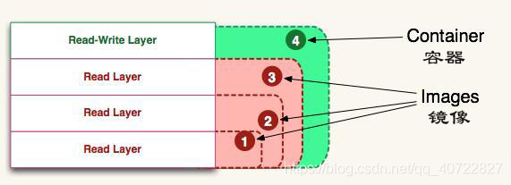

## .gitlab-ci.yml、Dockerfile、gitlab-runner

- **.gitlab-ci.yml**：定义 `pipeline` 阶段分级与每个阶段具体逻辑的文件。
- **Dockerfile**：用来构建镜像的文本文件，文本内容包含了一条条构建镜像所需的指令和说明。
- **gitlab-runner**：GitLab-Runner就是一个用来执行软件集成脚本的东西。你可以想象一下：Runner就像一个个的工人，而GitLab-CI就是这些工人的一个管理中心，所有工人都要在GitLab-CI里面登记注册，并且表明自己是为哪个工程服务的。当相应的工程发生变化时，GitLab-CI就会通知相应的工人执行软件集成脚本。


# Domains

- **CI机**：需要安装 `docker` 和 `gitlab-runner`。
- **服务机**：需要安装 `docker` 和 `docker-compose`。
- **Gitlab**：用于在云端存储项目，并且需要在项目中设置 `环境变量` 与 `gitlab-runner`。
- **阿里云容器镜像服务**：需要使用云商提供的容器镜像服务来构建 `远程镜像仓库`，本文以阿里云为例。

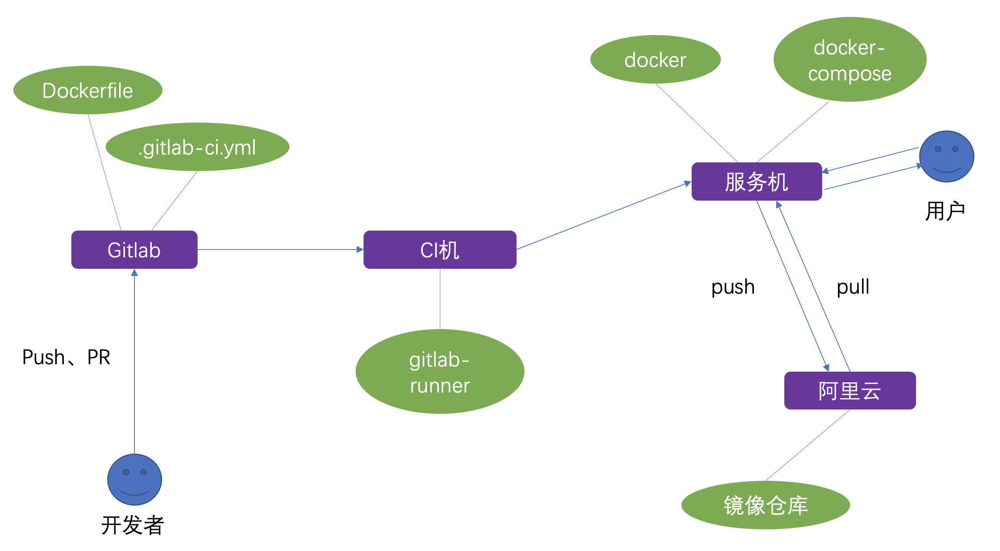

# Steps

## 1. 准备工作

### 1.1 CI机

你需要购买云商提供的ECS服务，CI机的配置要求并不高，一般来说 `2核/4GB/20Mbps` 即可。

### 1.2 服务机

你需要购买云商提供的ECS服务，建议服务机的配置设高一点，我这里是 `4核/16GB/20Mbps`

### 1.3 阿里云容器镜像服务

假设你已经注册过阿里云的账户并登陆，现在需要开通该账号下的容器镜像服务：

- 在阿里云官网中依次选择 `产品` -> `弹性计算` -> `容器镜像服务ACR`

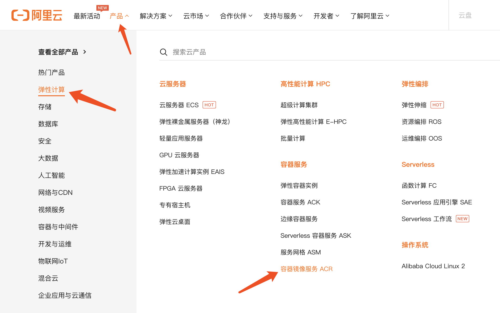

- 点击 `管理控制台`，并选择镜像仓库的主机地址，本文选择`华东2（上海）`，进入个人版实例：

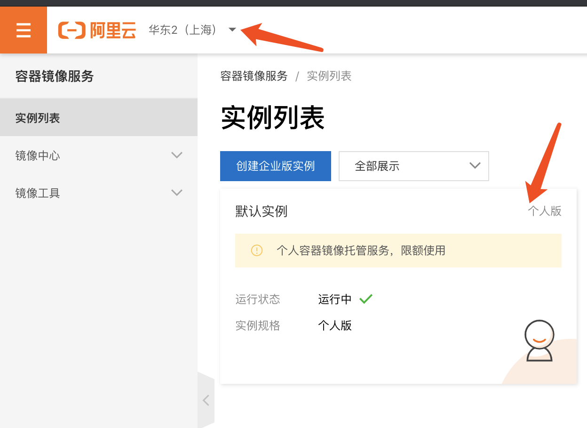

- 创建命名空间

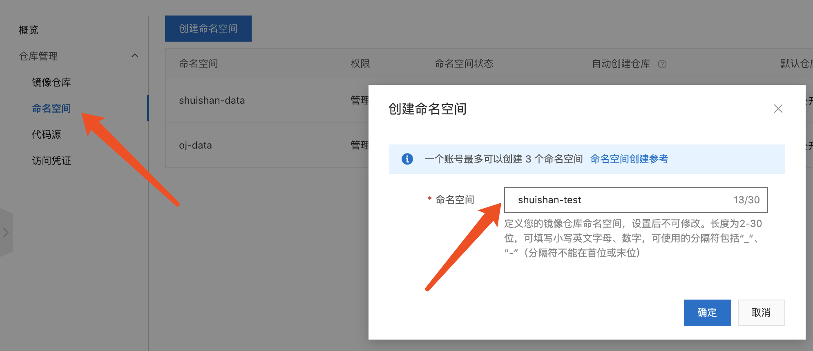

- 在该命名空间下创建一个镜像仓库

选择地域、命名空间，输入仓库名称、摘要和描述信息，仓库类型选择`私有`

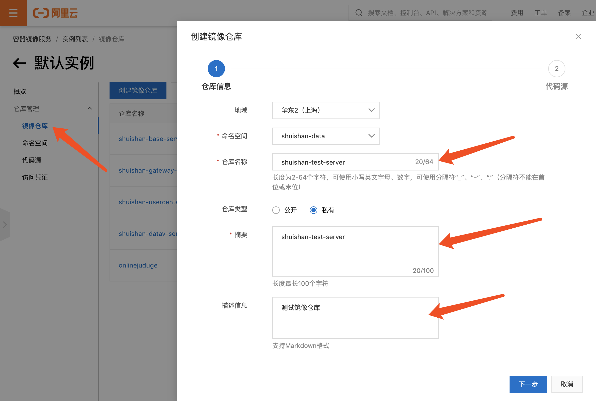

- 代码源选择`本地仓库`

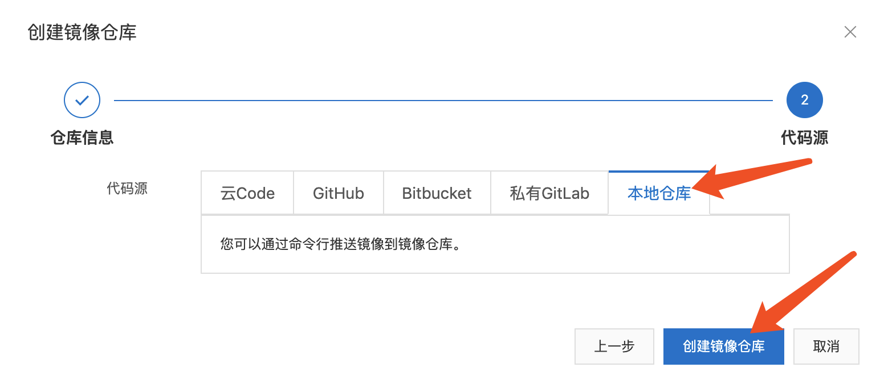

## 2. CI机操作

### 2.1 连接CI机

```bash
ssh root@xxx.xxx.xxx.xxx
```

### 2.2 安装docker并使其能自启动

```bash
curl -fsSL https://get.docker.com | bash -s docker --mirror Aliyun
systemctl enable docker
systemctl start docker
```

### 2.3 配置SSH key密钥对与服务机通信

```bash
ssh-keygen -t rsa -C "your_email@example.com"
ssh-add ~/.ssh/id_rsa
ssh-copy-id -i ~/.ssh/id_rsa.pub root@服务机IP
```

*注：这里配置 SSH key，是因为 CI/CD 的 `deploy` 阶段通常需要CI机的gitlab-runner通过ssh连接来执行服务机的命令。*

### 2.4 安装gitlab-runner并运行：

```bash
docker run -d --name gitlab-runner --restart always \
-v /srv/gitlab-runner/config:/etc/gitlab-runner \
-v /var/run/docker.sock:/var/run/docker.sock \
-v /root/.ssh:/root/.ssh \
```

我们来看下，在这个命令里面挂载了三个东西:
- [x] 第一个是gitlab-runner的配置文件
- [x] 第二个是为了让runner里面可以执行宿主机的docker
- [x] 第三个是为了让CI机能够免密访问服务机

### 2.5 将 runner 注册到 Gitlab 中

```bash
docker exec -it gitlab-runner gitlab-ci-multi-runner register
```

接下来你会进入一个命令行交互界面：

```terminal
Runtime platform                                    arch=amd64 os=linux pid=19 revision=a998cacd version=13.2.2
Running in system-mode.

Please enter the gitlab-ci coordinator URL (e.g. https://gitlab.com/):
https://code.kfcoding.com/
Please enter the gitlab-ci token for this runner:
bT*********ZcmD
Please enter the gitlab-ci description for this runner:
[b5f641f7df47]: shuishan-data-runner
Please enter the gitlab-ci tags for this runner (comma separated):
shuishan-data-runner
Registering runner... succeeded                     runner=bTYwz7Zf
Please enter the executor: custom, docker, parallels, ssh, docker-ssh, shell, virtualbox, docker+machine, docker-ssh+machine, kubernetes:
docker
Please enter the default Docker image (e.g. ruby:2.6):
ccchieh/centos-common
Runner registered successfully. Feel free to start it, but if it's running already the config should be automatically reloaded!
```

- 第一步：输入 Gitlab URL，比如 `https://code.kfcoding.com/`
- 第二步：输入 gitlab-ci token，这里就需要进入自己的gitlab仓库中的CI/CD设置里面，复制下自己仓库runner的token：

*注：这里所复制token的所在 group/project 决定了该 runner 的可用范围*

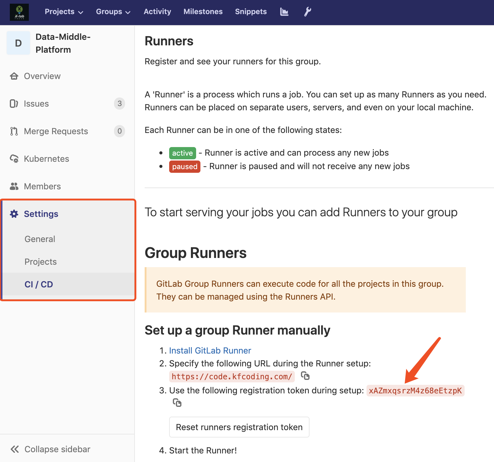

- 第三步：输入 runner 的 description、tags，其中 tags 会在后续 `.gitlab-ci.yml` 中用到
- 第四步：选择 runner 的执行器，这里我们选择 docker
- 第五步：选择默认的 docker 镜像，这里我用的是个人制作的基于centos的镜像，只是在官方的centos镜像基础上安装了openssh、git、nano，如果有其他需要的话也可以自己制作。

### 2.6 编辑 gitlab-runner 的配置文件

因为我们把配置文件挂载到宿主机了，所以我们只需要编辑宿主机的文件：

```bash
vim /srv/gitlab-runner/config/config.toml
```

这里贴出我的配置做参考：
```vim
concurrent = 10
[[runners]]
  name = "s****an"
  url = "https://co*******m/"
  token = "m********JFMHxD"
  executor = "docker"
  [runners.custom_build_dir]
  [runners.cache]
    [runners.cache.s3]
    [runners.cache.gcs]
  [runners.docker]
    tls_verify = false
    image = "ccchieh/centos-common"
    privileged = false
    disable_entrypoint_overwrite = false
    oom_kill_disable = false
    disable_cache = false
    volumes = ["/cache", "/var/run/docker.sock:/var/run/docker.sock", "/usr/bin/docker:/usr/bin/docker", "/data/.m2:/root/.m2", "/root/.ssh:/root/.ssh", "/root/.docker/:/root/.docker/"]
    pull_policy = "if-not-present"
    shm_size = 0
```

这里修改的主要是`concurrent`、`volumes`、`pull_policy`

- concurrent

表示这个runner可以并行执行多少任务，比较常见的就是同时提交多次任务时runner可以并行执行，或者在一次管道作业中同一个stage的任务可以并行完成，比如在图中的Build阶段，同时打包了4个子模块，在四个子模块中都会先下载依赖，这时如果最大并发数设置为默认1的时候会把花费很多时间，如果并发数大于4，那么Build阶段就可以并发完成。

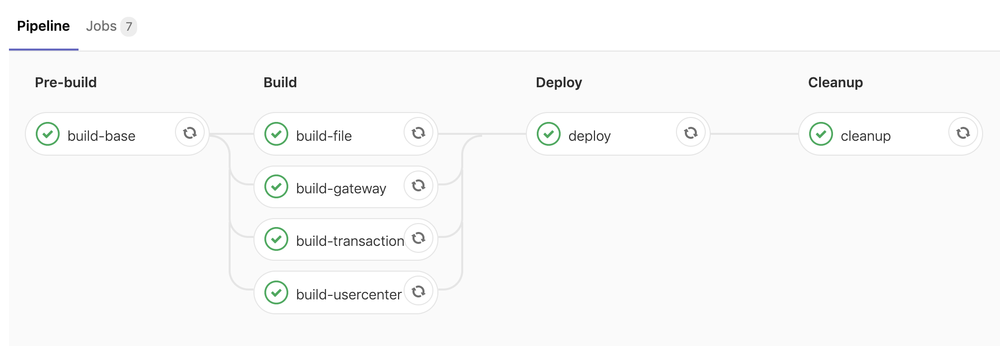

- volumes

挂载的目录，就是docker run 的时候用的 -v 挂载的目录，因为我们后面需要编译Dockerfile，所以将docker的相关目录文件挂载上去，然后挂载下maven仓库（这里是直接挂载了，实际使用的时候也可以利用gitlab-ci文件里面的cache进行缓存）避免每次打包编译java项目的时候都要下载一次依赖（这里是针对maven的，其他依赖管理软件视情况而定）。最后我这里直接把宿主机的.ssh也挂载上去了，是为了后面可以操作远程部署的服务器，因为我这里都是内网机器，所以安全性暂时不考虑，这里再实际应用中请注意下，避免不必要的风险。

- pull_policy

表示只有当本地没镜像的时候才拉取镜像，避免每次都重新拉取镜像。

## 3. 项目文件编写与Gitlab设置

### 3.1 设置项目的 gitlab-runner

这一步其实在2.5注册gitlab-runner输入token时已经完成了，点击项目的 `Settings` -> `CI/CD` -> `Runners`，确认之前注册的runner是`avaiable`的

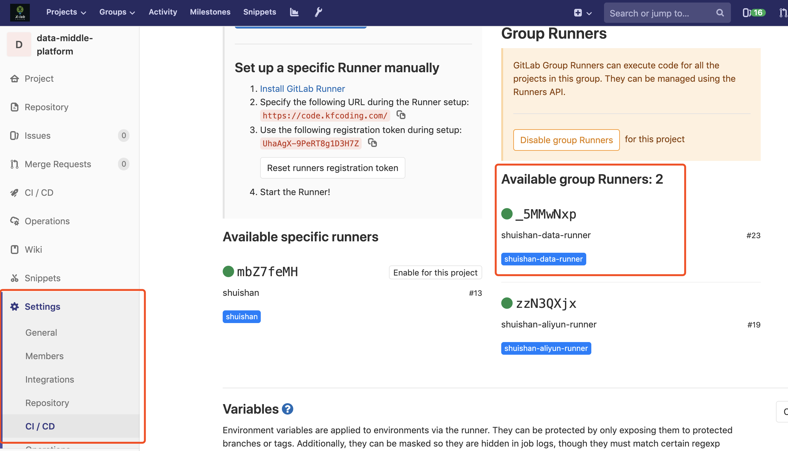

### 3.2 编写 Dockerfile

对于每个项目我们都需要编写一个Dockerfile用于实现对项目的编译打包，这里我们以Java微服务后端的项目为例简单介绍下，Dockerfile文件如下：

```dockerfile
# 构建一个基本的微服务打包环境,将公用模块install
FROM ccchieh/maven3-openjdk-8-cn as prod
ARG MY_HOME=/usr/src/app
COPY . $MY_HOME
WORKDIR $MY_HOME
ENV TIME_ZONE=Asia/Shanghai
RUN ln -snf /usr/share/zoneinfo/$TIME_ZONE /etc/localtime && echo $TIME_ZONE > /etc/timezone
RUN /usr/local/bin/mvn-entrypoint.sh mvn clean install
```

### 3.3 设置项目的环境变量

在.gitlab-ci.yml中是支持变量的，这样我们可以把如主机ip等敏感信息设置为变量，防止信息泄露。

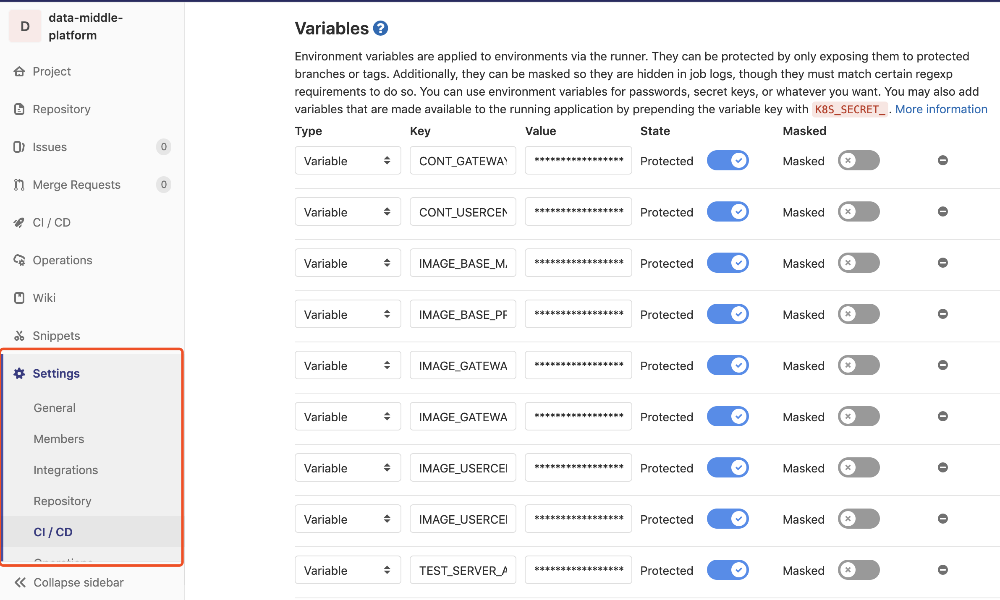

以我这里为例分别设置了容器名称、镜像私有仓库地址、部署服务器地址（如root@202.1.1.1）、服务器中的docker-compose的文件路径。

其中镜像私有仓库地址的前缀需要前往`步骤1.3`中新建的镜像仓库来获取：

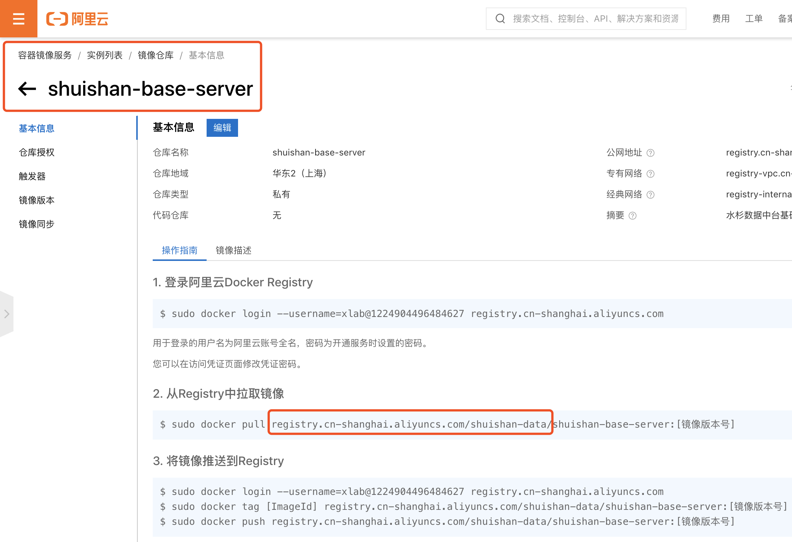

后缀是具体镜像的名称以及镜像版本号，版本号可以以不同分支的镜像来区分，比如 `master/prod`

### 3.4 编写 .gitlab-ci.yml

.gitlab-ci.yml文件定义了CI/CD pipeline的阶段与具体逻辑，这里我们分为四个阶段（pre-build、build、deploy、cleanup）来打包构建项目的镜像：

这里就用到了步骤3.3中设置的环境变量

```yml
stages:
  - pre-build
  - build
  - deploy
  - cleanup


build-base: # 预编译阶段
  stage: pre-build
  only:
    - master
  tags:
    - shuishan-data-runner
  script:
    # 先把基础目录编译成镜像
    - |
      docker build -t $IMAGE_BASE_MASTER .
      docker push $IMAGE_BASE_MASTER

build-gateway: # 编译阶段
  stage: build
  only:
    - master
  tags:
    - shuishan-data-runner
  script:
    # 打包gateway-zuul
    - |
      docker build --build-arg MODULE_NAME=$CONT_GATEWAY_NAME --build-arg PROFILE_NAME=dockerdev -t $IMAGE_GATEWAY_MASTER -f ./$CONT_GATEWAY_NAME/Dockerfile ./$CONT_GATEWAY_NAME
      docker push $IMAGE_GATEWAY_MASTER

build-usercenter: # 编译阶段
  stage: build
  only:
    - master
  tags:
    - shuishan-data-runner
  script:
    # 打包user-center
    - |
      docker build --build-arg MODULE_NAME=$CONT_USERCENTER_NAME --build-arg PROFILE_NAME=dockerdev -t $IMAGE_USERCENTER_MASTER -f ./bx-core-server/$CONT_USERCENTER_NAME/Dockerfile ./bx-core-server/$CONT_USERCENTER_NAME
      docker push $IMAGE_USERCENTER_MASTER


deploy: # 部署阶段
  stage: deploy
  only:
    - master
  tags:
    - shuishan-data-runner
  script:
    - |
      ssh $TEST_SERVER_ADDR docker-compose -f ${TEST_SERVER_PATH}/docker-compose.yml stop
      ssh $TEST_SERVER_ADDR docker-compose -f ${TEST_SERVER_PATH}/docker-compose.yml rm -sf $CONT_GATEWAY_NAME $CONT_USERCENTER_NAME
      ssh $TEST_SERVER_ADDR docker rmi $IMAGE_GATEWAY_MASTER $IMAGE_USERCENTER_MASTER
      ssh $TEST_SERVER_ADDR docker-compose -f ${TEST_SERVER_PATH}/docker-compose.yml up -d --build


cleanup: # 清理作业
  stage: cleanup
  only:
    - master
    - prod
  tags:
    - shuishan-data-runner
  script:
    - echo "回收垃圾"
  #    - docker system prune -f
  #  删除docker中间无用镜像，但是在并行的时候这么做会导致正在build的镜像失去中间层，使得build失败，所以推荐定期执行而不是在这里执行
  when: always
```

## 4. 服务机操作

### 4.1 连接服务机

```bash
ssh root@xxx.xxx.xxx.xxx
```

### 4.2 安装 docker 并使其能自启动

```bash
curl -fsSL https://get.docker.com | bash -s docker --mirror Aliyun
systemctl enable docker
systemctl start docker
```

### 4.3 安装 docker-compose

```bash
sudo curl -x socks5://dev.zzj.cool:10808 -L "https://github.com/docker/compose/releases/download/1.24.1/docker-compose-$(uname -s)-$(uname -m)" -o /usr/local/bin/docker-compose
sudo chmod +x /usr/local/bin/docker-compose
sudo ln -s /usr/local/bin/docker-compose /usr/bin/docker-compose
```

这里因为github的连接问题，我用了一个自建的socket代理服务：

*-x socks5://dev.zzj.cool:10808*

### 4.4 安装 Git

```bash
yum install -y git
```

### 4.5 编写 docker-compose.yml

Docker Compose默认的模板文件是`docker-compose.yml`，我们可以通过编在服务机上编写`docker-compose.yml`文件，将繁琐的docker命令整合成一个文件，最后通过一行命令来统一执行。

以我们的`docker-compose.yml`文件为例：

```yml
version: "3"
services:
  nacos:
    container_name: nacos-standalone
    image: nacos/nacos-server:latest
    environment:
    - PREFER_HOST_MODE=hostname
    - MODE=standalone
    restart: always
    volumes:
    - ./nacos/standalone-logs/:/home/nacos/logs
    - ./nacos/init.d/custom.properties:/home/nacos/init.d/custom.properties
    ports:
    - "8848:8848"
    networks:
      default:
        aliases:
         - nacos
  redis:
    container_name: metasequoia-redis
    restart: always
    image: "redis:alpine"
    networks:
      default:
        aliases:
         - redis
# 后端 
  bx-gateway-zuul:
    container_name: bx-gateway-zuul
    image: registry.cn-shanghai.aliyuncs.com/shuishan-data/shuishan-gateway-server:master
    restart: always
    volumes:
    - ./bx-gateway-zuul-logs/:/logs/
    ports:
    - "8080:8080"
    networks:
      default:
        aliases:
         - api # 设置api服务的别名
    environment:
    - NACOS_ADDR=nacos
    - NACOS_PORT=8848
  user-center:
    container_name: user-center
    image: registry.cn-shanghai.aliyuncs.com/shuishan-data/shuishan-usercenter-server:master
    restart: always
    volumes:
    - ./user-center-logs/:/logs/
    environment:
    - NACOS_ADDR=nacos
    - NACOS_PORT=8848
    networks:
      default:
        aliases:
         - usercenter
  shuishan-datav-server:
    container_name: shuishan-datav-server
    image: registry.cn-shanghai.aliyuncs.com/shuishan-data/shuishan-datav-server:master
    restart: always
    volumes:
    - ./shuishan-datav-server-logs/:/logs/
    - ./data/:/root/data/
    environment:
    - NACOS_ADDR=nacos
    - NACOS_PORT=8848
```

这里我们需要打包构建的服务镜像包括：nacos服务发现镜像、redis服务镜像、网关服务镜像、用户鉴权服务镜像、子服务镜像(shuishan-datav-server)。

其中image的前缀获取方式与`步骤3.3`相同

### 4.6 构建项目的容器镜像

进入到包含`docker-compose.yml`的目录后：

```bash
docker-compose -f ./docker-compose.yml up -d --build
```

该命令可以自动完成包括构建镜像，(重新)创建服务，启动服务，并关联服务相关容器的一系列操作。

至此，我们已经实现了项目的CI/CD，可以通过向项目push代码触发pipeline来测试整个流程。

# Appendix:

- 查看宿主机下所有容器：

```bash
docker ps -a
```

- 停止所有容器：
```bash
docker stop $(docker ps -aq)
```

- 清除所有容器
```bash
docker rm $(docker ps -aq)
```

